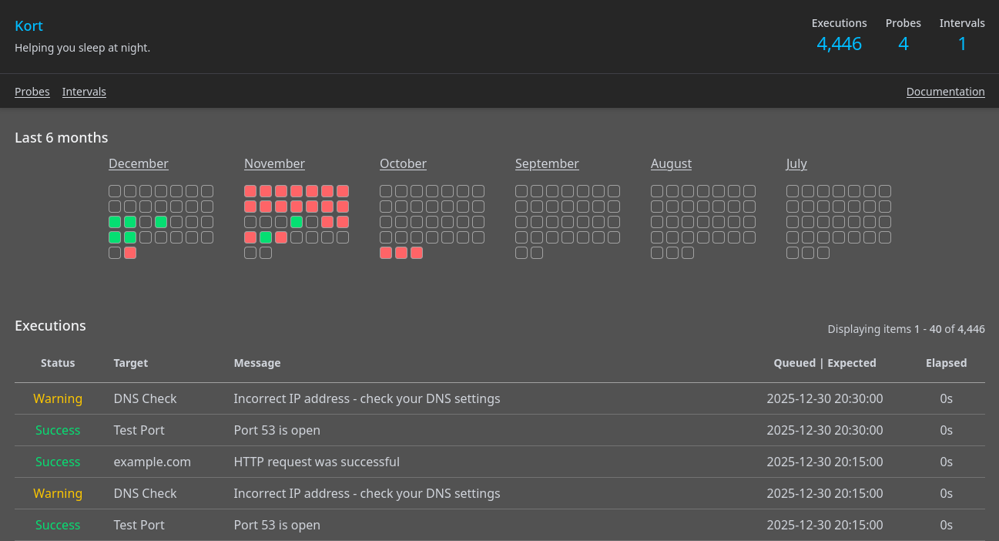

# Kort

An opinionated uptime and health checks system that give you the full picture upfront. Helping you sleep at night by keeping your systems healthy and predictable.

__Warning: This software is still in beta. Expect things to change. When ready an official 0.1 release will be made public.__



## Features

- Intervals - ping health check with status
- Probes - reach out to service to ensure its running
  - HTTP(S)
  - Port
  - Docker
  - DNS
- Flexible schedules - uses [Systemd's OnCalendar format](https://www.freedesktop.org/software/systemd/man/latest/systemd.time.html#Calendar%20Events)
- Evaluator functions - allows flexible status detection logic using Ruby
- Calendar view - quickly see status overview
- Log output - see exactly what went wrong

## Getting Started

Kort has been designed to run inside a container. No other installation methods are supported at this stage. Using a container compose file:

```yaml
version: '3.4'
services:
  kort:
    image: kort:dev
    ports:
      - 3000:3000
    volumes:
      - config:/rails/storage
      - /run/user/1000/podman/podman.sock:/var/run/docker.sock # Docker/Podamn support
    restart: unless-stopped
```

You should now see an empty Kort instance at ```http://localhost:3000```.

## Intervals

Intervals (known as Health Checks in other systems) allow you to specify a recurrence and grace period for which a job should be executed. The job is responsible for signaling Kort about its status. To signal an interval you can:

1. (Optional) Start a job by signaling Kort. This allows Kort to track the runtime of your job.

```sh
GET /interval/[INTERVAL_ID]/signal/start
```

2. Set status of interval by supplying the following parameters. Status can be one of the following (success | skipped | warning | failure) or an exit code (0 = success, >0 = failure). Message (optional) can be any status message you desire. Remember the outcome of any interval or probe can be adjusted with your own custom logic. 

```sh
GET /interval/[INTERVAL_ID]/signal?status=[STATUS]&message=[MESSAGE]
```

3. (Optional) If there are additional logs you wish to store with this interval execution you can use the following endpoint:

```sh
POST /interval[INTERVAL_ID]/signal/log
```

## Probes

Probes can be configured with a recurrence and type of any of the following:

- HTTP(S) - make a web request and ensure it returns 200
- DNS - successfully queries a DNS server
- Port - determines if a TCP port is open
- Docker - ensures a running status of container

All status logic can be changed using evaluator functions. See the next section for an example of this.

## Evaluator Functions

Evaluator functions allow you to control the logic that determines the outcome of a interval or probe. Written in [Ruby](https://www.ruby-lang.org/en/) these functions have access to the properties of the interval or probe and require a status and message as an output. An example checking whether or not an IP address was returned from a DNS probe is below:

```ruby
# @result in this case is an instance of Dnsruby::Message based on Probe::Dns
if @result.answer.map {|rr| rr.address.to_s }.include?("192.168.1.1")
  success!
  message!("It worked!")
else
  warning!
  message!("Incorrect IP address - check your DNS settings")
end
```

You can use ```success!```, ```skipped!```, ```warning!```, ```failure!```, ```message!("message")``` inside your evaluator functions to set your desired outcome.

__Warning__: Do not paste untrusted code you do not understand in Kort. This code can access any part of your Kort system - especially if you have authentication tokens for external services. This flexibility comes with great responsibility.

## Contributions

Contributions are welcome should they fit the original mission statement for Kort. Please make sure you include tests for any changes.

## Roadmap

- Email notifications

## Motivation

After using other projects like Uptime Kuma and Health Checks for many years I needed a system that allowed a log first approach with custom status logic. In many cases I had jobs failing that were merely warning me about something - therefore I built Kort to fill that need.


